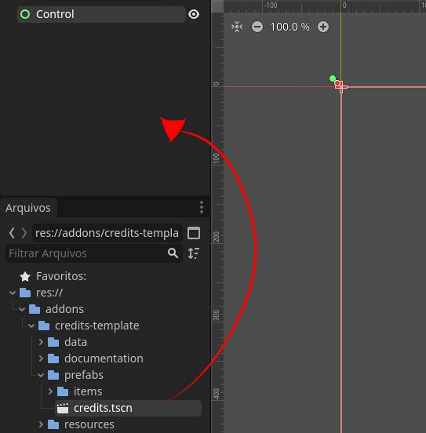
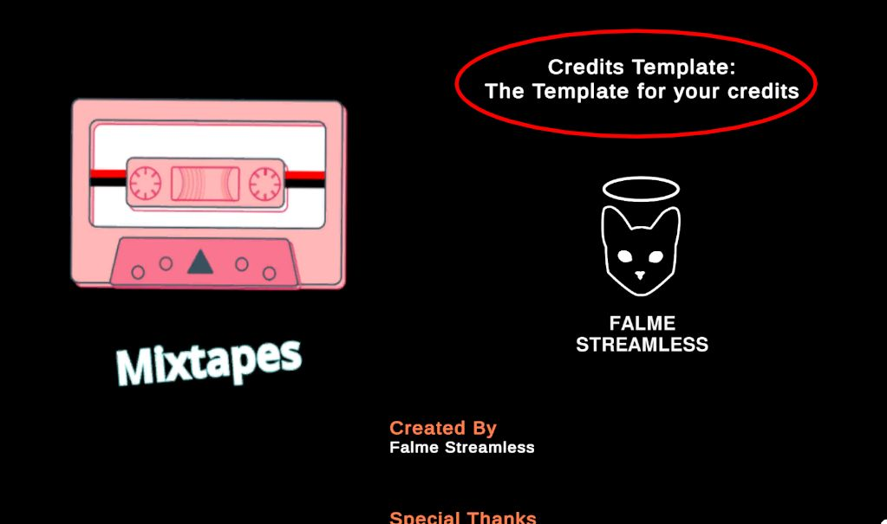
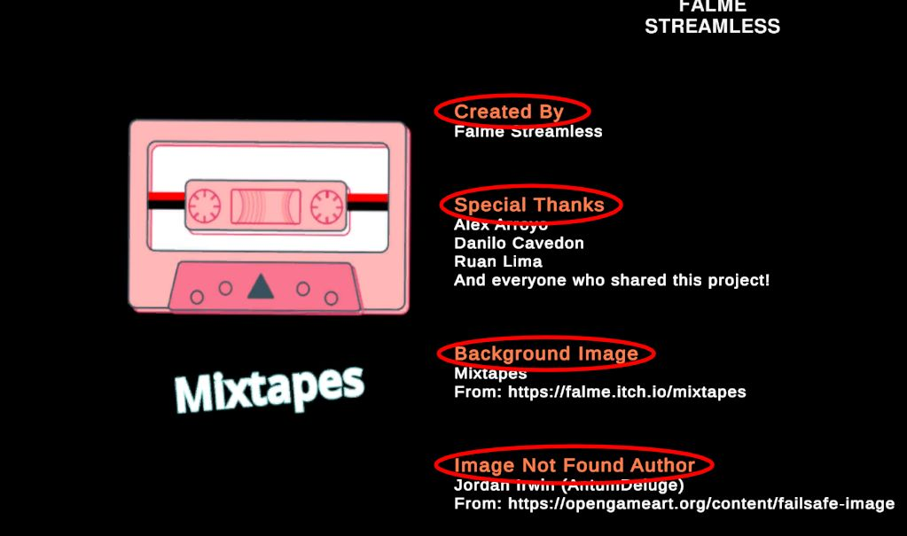
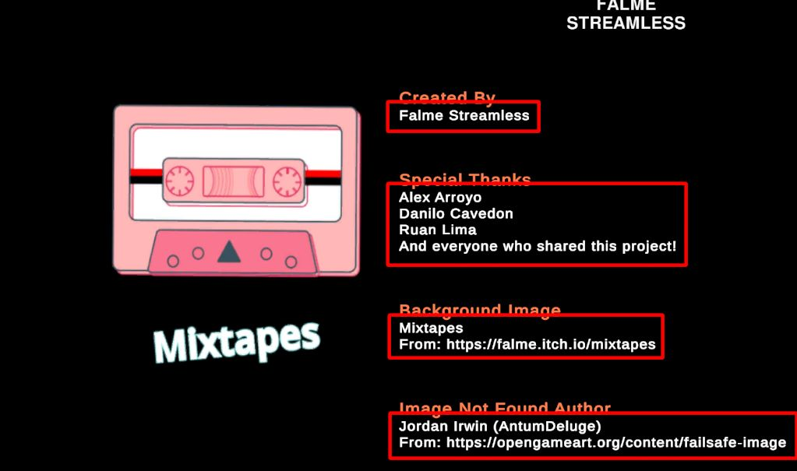
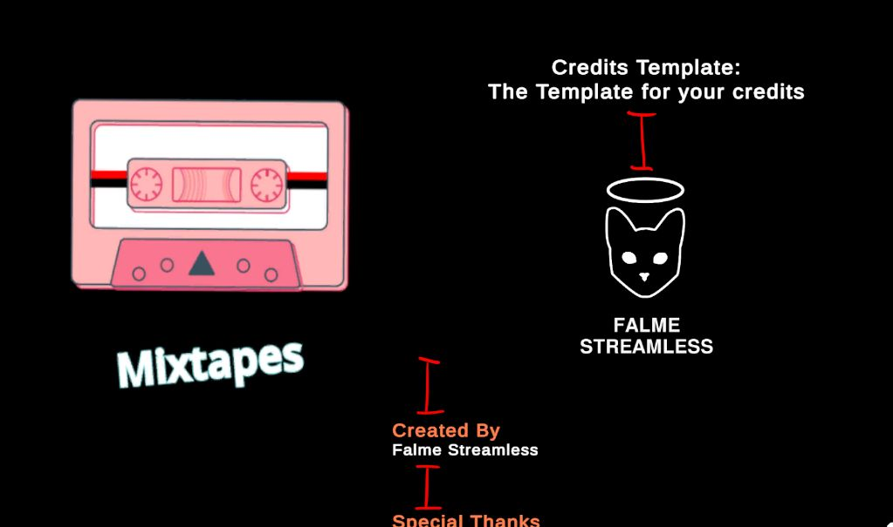
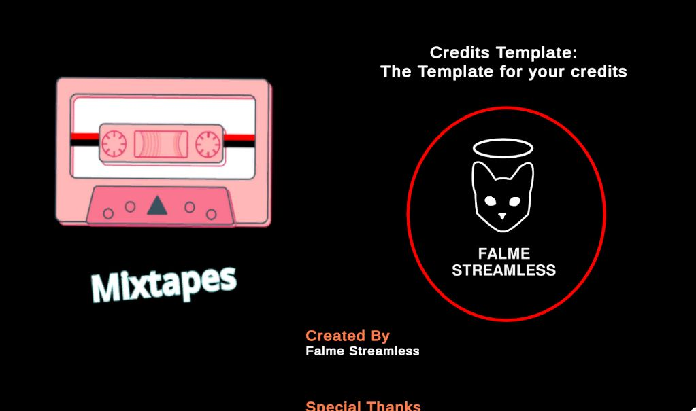

# Credits Template (Godot Edition) : Documentation

## Installation

1. Download the Credits Template Package
	- [GitHub Releases Page](https://github.com/Falme/credits-template-godot/releases)
2. Add to your Godot Project folder `res://`
	- It should be something like: `res://addons/credits-template`
3. Drag and Drop the node at `res://addons/credits-template/prefabs/credits.tscn` to your scene or into a predefined Control node
	- 

## Configurations

All the configurations is predefined into the node OR can be modified in the JSON data found at `res://addons/credits-template/data/credits.json`.

The JSON file can configure quickly your information inside the credits and the velocity of it.
The Nodes can configure the visuals of your credits scene, changing fonts, size, colors and etc.

### JSON Data

I suggest that you check how is the currently `credits.json` file and follow that structure, you are not limited to it, but I truly recommend that.

The basic structure is:

```json
{
	"version" : "x.x.x",
	"velocity" : 100,
	"items" : [ Array of items objects ]
}
```

Items is an object that have a type and predefined values, here's the structure for each one:

#### Title

The type `title` is a label of text, usually used as a title of the credits and/or the name of the game:

```json
{
	"type": "title",
	"text": "The name of your game \nThe Next line of the same title"
}
```



This looks like it's unique and should not be repeated, but that's not true, you can repeat this object many times you want.

#### Category

The type `category` is a label of text for the roles of the team, usually a header before the names that worked at that role.

```json
{
	"type": "category",
	"text": "The role of those who worked in the game (Producer, QA)"
}
```



#### Actors

The type `actors` is a label of text for the names of the people who worked in the project. This item have an Array for the names for you to input.

```json
{
	"type": "actor",
	"actors": [
		"First Person Name",
		"Second Person Name",
		"Other Person Name",
		"And Another Person Name"
	]
}
```



I've checked some examples and there's some credits that is just a wall of names, for performance sake do not put every single name into the actors array, try to separate it in chunks. There's no recommended number like 5, 10 or 25. Usually this space is defined by the UI screen size, if your game have small or big resolution, adequate the chunks based on what looks best on screen.

If you have no idea, 10 is a number that I use normally.

#### Space

The type `space` is an interface element that has a specific height. This is used to separate items one from another for better interface disposition.

```json
{
	"type": "space",
	"height": 100.0
}
```



#### Image

The type `image` is a Texture in the interface that loads an image from the folder `res://`. You must define a height for the image, just like the item `space`.

```json
{
	"type": "image", 
	"path": "FolderNameInRes/image_you_want_to_load.png", 
	"height": 300
}
```



The image is being loaded on the runtime directly to the memory, so be mindful that big images or too many images could affect the performance.

With that, we covered all the possible items in the current version.

## Creating Your Own Item

If this is not sufficient for your needs, you could create your own item.

### 1. Creating the Node

First of all, you will need to create a new interface node, the way you will do it does not matter, but I recommend that you add a parent and a child to it.

Visually, it looks something like this:

```
- item_name # deals with the logic of the item (extends the CT_Item class)
	- item_name_child # deals with the visuals of the item
```

Every item will be placed inside a Node called `CreditsStaff` and it contains the `VBoxContainer` inheritance, making it show the items sequentially, like a list.

After creating the visuals for your item, we need to add the Script.

### 2. Creating the Script

The script that you will create MUST inherit from `CT_Item`. This abstract script have the necessary to connect and manage itself with the Pooling System. So, the basics of the new script should be something like:

```gdscript
class_name YourItemClassName
extends CT_Item

# This is the first function your item will call, 
# threat as an _init() or _ready()
func initialize(item: Dictionary) -> void:
	# check for loading data errors
	if has_errors(item):
		return
	
	print(item.new_field)


func has_errors(item: Dictionary) -> bool:
	if not item.has("new_field"):
		printerr("Credits Template : item \
				requires an array field 'new_field'!")
		return true

	return false
```

The method `initialize(item: Dictionary)` is called from the pooling system, and this is how you call the information of your item from JSON.

Then, add this script to the node that deals with the logic of the item (formerly knows as the root of the item scene, parent of the visuals of the item)

### 3. Adding Your Node to the List

All the items are contained inside a Resource at `res://addons/credits-template/resources/item_list.tres`. Just add your new item to the list with the following parameters:

- id : unique name for your item, must be in lowercase and it should match the json `type` field.
- node : the node/scene of your item

With this, the pooling system is ready to store and use your new item.

### 4. Adding the Item to the JSON Data

After setting up your new Item, it's time to test with the data. Open the JSON data file at `res://addons/credits-template/data/credits.json` and add your new item to the file, for example, if your item id is called "subcategory" it will looks like:

```json
{
	"type" : "subcategory",
	"text" : "the text for your subcategory"
}
```

With that, your new item should be working as expected.


## Found a Bug or have a Feedback?

I do not have a proper place for that, for informal conversation reach me at my [Bluesky](https://bsky.app/profile/falme.com.br), if it's technical things, open an issue in the [GitHub](https://github.com/Falme/credits-template-godot/issues) repository page, so we all could discuss that.
